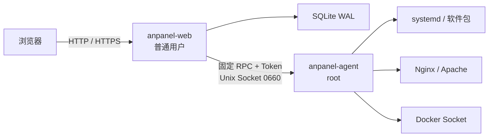

# AnPanel

[](https://github.com/matthewlu070111/anpanel/actions/workflows/ci.yml)
[](https://github.com/matthewlu070111/anpanel/actions/workflows/release.yml)

AnPanel 是面向单台 Linux 服务器的轻量监控与服务管理面板。后端使用 Go，React + TypeScript 管理端嵌入同一个静态二进制；服务器运行时不依赖 Node.js、PHP 或外部数据库。

> 项目目前处于首版工程验证阶段。核心链路可以构建和运行，但正式部署前仍应在目标发行版 VM 中验证安装、换源和 Web 配置回滚，尤其是 EOL 系统与已有复杂 Nginx/Apache 配置的服务器。

## 功能概览

| 模块 | 当前能力 |
| --- | --- |
| 主机监控 | CPU、负载、内存、Swap、磁盘、网络、进程、端口与运行时间；实时及分层历史指标 |
| 服务检测 | 识别 Nginx、Apache、Docker Engine/Compose、certbot、acme.sh 的版本、状态与路径 |
| Docker | 容器生命周期、镜像/网络/卷清单与受限操作、Compose 任务、鉴权终端 |
| Web 服务 | Nginx/Apache 站点发现、原始指令保留、语法验证、原子写入、reload 失败回滚 |
| 域名与证书 | 反向代理入口、DNS 检查、certbot/acme.sh、失败回滚与 IP 入口恢复 |
| 告警 | SMTP、通用 Webhook、持续时间、恢复通知、静默期和重复通知 |
| 安全 | 双进程权限边界、Argon2id、TOTP、CSRF、登录限速、会话撤销与完整审计 |
| 安装与恢复 | 地区镜像探测、源备份/验证/回滚、随机端口、systemd 与离线恢复命令 |

## 架构



`anpanel-web` 负责 UI、认证、API、任务和审计；`anpanel-agent` 只接受白名单动作，不提供任意 Shell 接口。

## 支持范围

- 架构：Linux `amd64`、`arm64`
- Ubuntu：18.04、20.04、22.04、24.04、26.04
- Debian：10、11、12、13
- CentOS：7
- Rocky Linux / AlmaLinux：8、9、10

EOL 系统使用归档源只能维持软件包可获取性，不能恢复安全维护。安装器会保留已启用的扩展维护订阅和第三方仓库，并在缺少安全更新时给出持续警告。

## 快速安装

从 GitHub Release 安装最新版本：

```bash
curl -fsSL https://github.com/matthewlu070111/anpanel/releases/latest/download/install.sh | sudo bash
```

常用参数：

```bash
sudo bash install.sh --region=cn
sudo bash install.sh --region=global --open-firewall
sudo bash install.sh --version=v0.1.0
```

安装默认分支 CI 最近一次成功构建的 prerelease：

```bash
curl -fsSL https://github.com/matthewlu070111/anpanel/releases/download/prerelease-latest/install.sh | sudo bash
```

这个固定地址只提供安装入口；安装器内部锁定实际的 `build-{commit_id}`，不会回退到 stable。

- `--region=cn|global`：覆盖自动地区判断。
- `--open-firewall`：显式放行面板随机端口；默认不修改主机防火墙，也不会修改云安全组。
- `--version`：安装指定 Release 标签。

安装完成后，终端会显示随机端口和一次性 `admin` 密码。密码不会写入普通日志，首次登录必须修改用户名与密码。未绑定域名时使用明文 HTTP，请仅在可信网络中初始化并尽快配置 HTTPS。

## 本地开发与构建

要求 Go 1.24+、Node.js 22+、GNU Make 和 Bash：

```bash
make web
make test
make release VERSION=v0.1.0
```

发布产物位于 `dist/`：

- `anpanel-linux-amd64`、`anpanel-linux-arm64`
- 每个二进制对应的 `.sha256`
- 自包含安装器 `install.sh`

GitHub Actions 会在 `ci` 成功后创建 `build-{commit_id}` prerelease；如果该提交带有 `v*` 标签，则创建正式 Release。也可以手动运行工作流。完整流程与签名配置见 [发布指南](docs/RELEASING.md)。

## 安装目录

| 路径 | 用途 |
| --- | --- |
| `/usr/local/bin/anpanel` | 主程序 |
| `/usr/local/bin/anpanelctl` | 恢复命令入口 |
| `/etc/anpanel` | 配置、Token 与凭据 |
| `/var/lib/anpanel` | SQLite 数据库、备份与任务数据 |
| `/var/log/anpanel` | 运行日志 |
| `/run/anpanel/agent.sock` | Web 与 agent 的受限 Unix Socket |

## 恢复访问

```bash
sudo anpanelctl show-port
sudo anpanelctl recover-access
sudo anpanelctl reset-admin
sudo anpanelctl disable-totp
```

`recover-access` 用于反向代理或域名配置故障后的本地入口恢复；`reset-admin` 会生成新的临时凭据。

## 安全说明

- Web 服务以 `anpanel` 普通用户运行，特权请求通过 Unix Socket 和独立 agent token 发送。
- Compose 文件仅允许位于 `/etc/anpanel/compose`、`/opt` 或 `/srv`。
- Web 配置变更先执行 `nginx -t` 或 `apachectl configtest`，失败时恢复上一版本。
- 换源前创建完整备份，索引或缓存校验失败会自动回滚；Docker、EPEL、PPA 等用户仓库不会被改写。
- 删除容器、镜像、网络和卷需要二次确认；底层动作默认不启用强制删除。
- Release 始终提供 SHA-256；配置 Ed25519 密钥后还会发布二进制签名。

发现安全问题时，请避免在公开 Issue 中披露凭据、服务器地址或可利用细节。

## 文档

- [API 与动作约定](docs/API.md)
- [构建和发布](docs/RELEASING.md)
- [路线图与验收状态](docs/ROADMAP.md)

## 当前边界

首版聚焦单服务器、单管理员场景，不包含多服务器集群、数据库/PHP 应用商店、完整文件管理器、宿主机 Web 终端或防火墙管理。尚未在完整发行版矩阵中验证的功能会明确记录在路线图中。
